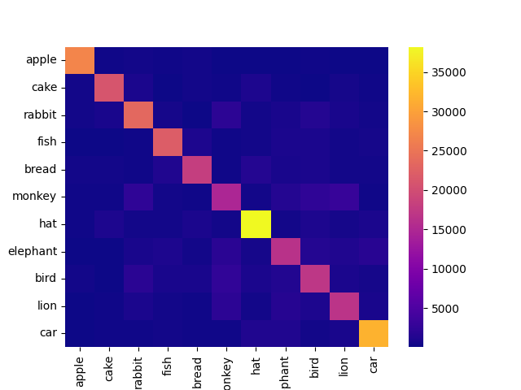

# Drawing Recognintion Game with MediaPine

The project is built around drawing and recognizing that drawing.

### Demo

### Predict Table

## Table of Contents

* [About The Project](#About-The-Project)
* [Getting Started](#Getting-Started)
  * [Prerequisites](#Prerequisites)
  * [Project structure](#Project-structure)
  * [Installation](#Installation)

## About The Project
* The dataset is taken from Quick Draw. You can get the dataset [here](https://github.com/googlecreativelab/quickdraw-dataset)
* This is collected and divided into 2 datasets: train and test. You must be put in `data` folder.
* Labels = ['apple', 'cake', 'rabbit',  'fish',  'bread',  'monkey', 'hat', 'elephant', 'bird', 'lion', 'car']
## Project structure
```
├── app
│    └── main.py
├── data
│   ├── test_label.npy
│   ├── test.npy
│   ├── train_label.npy
│   └── train.npy
├── images
│── pie_chart.png
│   ├── pie_chart_test.png
│   ├── pie_chart_train.png
│   ├── PredictTable.png
│   └── video.gif
├── model
│   ├── best_model.pth5
│   └── last_model.pth5
├── README.md
└── src
    ├── dataset.py
    ├── model.py
    ├── test.py
    ├── train.py
    └── visualazation.py
```

## Getting Started
### Prerequisites
You need to install the following software on your computer:
* Python 3.9 or latest
* pip
### Installation
1. **Clone the repository:**
<pre>
git clone https://github.com/alloc110/Drawing-Recognition-Game
cd Drawing-Recognition-Game
</pre>
2. **Create virtual environment:** 
<pre>
python -m venv Drawing-Recognition-Game
</pre>
3. **Install Packages:** 
<pre>
pip install requiretment.txt
</pre>
4. **Download dataset:**
After downloading the dataset, put it in the ``dataset`` folder.
<pre>
python src/preprocess.py
</pre>

5. **Run main.py:** 
<pre>
python app/main.py
</pre>